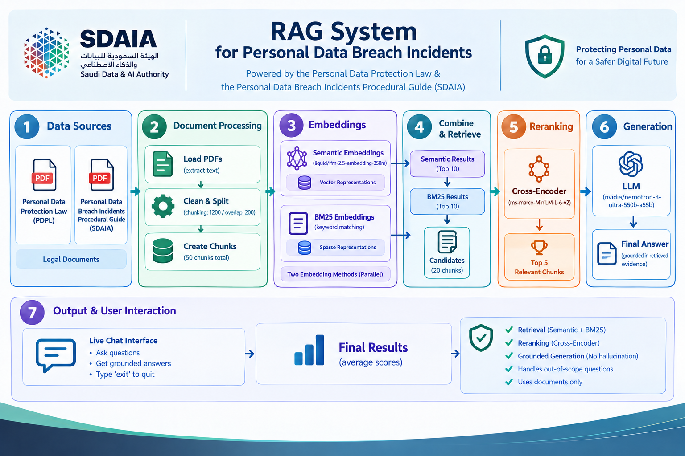

# DataLeak Retrieval Strategy Analyzer

**Modern Data Engineering for Advanced AI Systems --- SDAIA Academy**

## Project Description

**DataLeak Retrieval Strategy Analyzer** is a Retrieval-Augmented
Generation (RAG) system designed to answer questions from official
personal-data protection documents.

The project uses two source documents:

-   **Personal Data Protection Law (PDPL)**
-   **Personal Data Breach Incidents Procedural Guide (SDAIA)**

The main focus is **retrieval quality**. The system uses Semantic Search
and BM25 as complementary retrieval strategies, combines their
candidates, and then applies a Cross-Encoder to rerank them before
generating a final answer with an LLM.

The final answer is grounded in retrieved document evidence and the
generation prompt instructs the model not to use outside knowledge or
invent information.

## Project Importance

Legal and procedural documents require accurate retrieval because small
differences in wording can affect the meaning of an answer. This project
demonstrates a practical RAG pipeline that combines semantic retrieval,
keyword retrieval, reranking, and evidence-grounded generation.

## Objectives

-   Build a document-based RAG system for personal-data protection
    documents.
-   Extract and preprocess text from PDF files.
-   Split documents into overlapping chunks.
-   Generate and cache document embeddings.
-   Retrieve relevant chunks using Semantic Search and BM25.
-   Combine candidates from both retrieval methods.
-   Rerank candidates using a Cross-Encoder.
-   Pass the top 5 relevant chunks to the LLM.
-   Generate answers using only retrieved evidence.
-   Support interactive questions through terminal-based live chat.

## Data Sources

### Personal Data Protection Law (PDPL)

Provides definitions and provisions related to personal data, sensitive
data, data subjects, processing, disclosure, retention, security
measures, violations, and penalties.

### Personal Data Breach Incidents Procedural Guide

Provides procedures for handling personal data breach incidents,
including notification, containment, affected data and individuals,
risks, and corrective actions.

## System Architecture



``` text
                    Data Sources
                         |
                         v
               Document Processing
              PDF Extraction / Cleaning
                 Chunking (1200/200)
                         |
                         v
              +-----------------------+
              |   Retrieval Layer    |
              |                       |
              | Semantic Search       |
              |        +              |
              | BM25 Search           |
              +-----------+-----------+
                          |
                          v
                  Candidate Set
                    Up to 20
                          |
                          v
              Cross-Encoder Reranking
                          |
                          v
                    Top 5 Chunks
                          |
                          v
                    LLM Generation
                          |
                          v
                    Final Answer
```

> **Note:** The final implementation does not include a separate
> evaluation stage, Hybrid RRF, or a vector database. Embeddings are
> stored in a local cache file for reuse.

## Methodology

### 1. Document Processing

PDF files are loaded using **PyMuPDF**. Text is extracted page by page,
cleaned, and split into overlapping chunks.

``` text
Chunk size: 1200 characters
Overlap: 200 characters
Total chunks: 50
```

### 2. Embeddings

Document chunks are converted into embeddings using:

``` text
liquid/lfm-2.5-embedding-350m:free
```

Embeddings are accessed through OpenRouter and cached locally in:

``` text
data/embeddings_cache.npz
```

### 3. Semantic Search

Semantic Search compares the query embedding with document-chunk
embeddings using cosine similarity and retrieves the **Top 10** results.

### 4. BM25 Search

BM25 provides keyword-based retrieval and retrieves the **Top 10**
results. It complements semantic retrieval by identifying chunks
containing important query terms.

### 5. Candidate Combination

``` text
Semantic Search Top 10
          +
BM25 Search Top 10
          |
          v
Candidate Set (up to 20)
```

Duplicate chunks are removed before reranking.

### 6. Cross-Encoder Reranking

Candidates are reranked using:

``` text
cross-encoder/ms-marco-MiniLM-L-6-v2
```

The Cross-Encoder evaluates the query together with each candidate chunk
and selects the **Top 5 Relevant Chunks** for generation.

### 7. Answer Generation

The final answer is generated using:

``` text
nvidia/nemotron-3-ultra-550b-a55b:free
```

The prompt instructs the model to use only retrieved evidence, avoid
outside knowledge, avoid unsupported information, and state when the
evidence is insufficient.

## Example

### Query

``` text
What is personal data according to Article 1?
```

### Retrieval Flow

``` text
Query
  |
  +--> Semantic Search --> Top 10
  |
  +--> BM25 Search ------> Top 10
             |
             v
       Candidate Set
             |
             v
    Cross-Encoder Reranking
             |
             v
          Top 5
             |
             v
            LLM
             |
             v
       Grounded Answer
```

### Example Answer

``` text
According to Article 1 of the Personal Data Protection Law, Personal Data
is defined as any data, regardless of its source or form, that may lead to
identifying an individual specifically, or that may directly or indirectly
make it possible to identify an individual.
```

## Results

The system was tested using document-related questions and an
out-of-scope question.

### Test Questions

1.  What is personal data according to Article 1?
2.  In which cases may Personal Data be processed without the consent of
    the Data Subject under Article 6?
3.  What is Sensitive Data?
4.  When must a Controller notify SDAIA about a personal data breach?
5.  What are the three stages for handling a personal data breach
    incident?
6.  What are the possible risks or consequences of a personal data
    breach mentioned in the procedural guide?
7.  What is the penalty for violating the Personal Data Protection Law?
8.  What is artificial intelligence?

### Observations

-   Semantic Search and BM25 produced complementary candidate sets.
-   Cross-Encoder reranking changed candidate ordering and selected the
    top 5 passages for generation.
-   The system generated grounded answers for the tested
    document-related questions.
-   For the out-of-scope question about artificial intelligence, the
    system did not use outside knowledge and indicated that the provided
    documents did not contain enough information.
-   During one test, retrieval and reranking completed successfully but
    the external LLM provider temporarily returned a
    `502 provider_unavailable` error. This was a provider-side
    generation failure rather than a retrieval failure.

## Technologies and Models

  Component              Technology
  ---------------------- ------------------------------------------
  Programming Language   Python
  PDF Processing         PyMuPDF
  Embeddings             `liquid/lfm-2.5-embedding-350m:free`
  Similarity             Cosine Similarity
  Keyword Retrieval      BM25
  Reranking              `cross-encoder/ms-marco-MiniLM-L-6-v2`
  LLM Generation         `nvidia/nemotron-3-ultra-550b-a55b:free`
  API Access             OpenRouter
  Numerical Processing   NumPy

## Project Structure

``` text
DataLeak_Retrieval_Strategy_Analyzer/
|
+-- data/
|   +-- raw/
|   |   +-- PersonalDataProtectionLaw.pdf
|   |   +-- PersonalDataBreachIncidents.pdf
|   |
|   +-- embeddings_cache.npz
|
+-- retrieval_debugger.py
+-- requirements.txt
+-- architecture.png
+-- README.md
```

## Installation

Clone the repository:

``` bash
git clone <YOUR_GITHUB_REPOSITORY_URL>
cd DataLeak_Retrieval_Strategy_Analyzer
```

Create and activate a virtual environment:

``` bash
python -m venv .venv
```

Windows PowerShell:

``` powershell
.venv\\Scripts\\Activate.ps1
```

Install dependencies:

``` powershell
pip install -r requirements.txt
```

## Configuration

Set the OpenRouter API key as an environment variable:

``` powershell
$env:OPENROUTER_API_KEY="YOUR_API_KEY"
```

Do **not** place the API key directly in the source code or commit it to
GitHub.

## How to Run

``` powershell
python retrieval_debugger.py
```

The system loads the documents, creates or loads the embedding cache,
and starts the live chat.

Example:

``` text
System ready.

Ask questions about the provided documents.
Type 'exit' to quit.

You: What is personal data according to Article 1?

Assistant:
According to Article 1 of the Personal Data Protection Law, ...
```

Type `exit` to end the session.

## Limitations

-   The system is limited to the information contained in the provided
    documents.
-   Retrieval quality depends on chunking and retrieval models.
-   Cross-Encoder scores are ranking scores, not probability values.
-   LLM generation depends on the availability of the external model
    provider.
-   The current implementation is a document-based RAG prototype rather
    than a general-purpose legal assistant.

## Future Improvements

-   Graphical user interface.
-   Structure-aware document chunking.
-   Metadata and Article-based filtering.
-   Additional document sources.
-   Provider fallback handling.
-   More detailed source/page citations in generated answers.
-   Comparison of additional retrieval and reranking models.

## Course / Project Context

This project was developed as part of:

**Modern Data Engineering for Advanced AI Systems --- SDAIA Academy**

SDAIA Academy GitHub: https://github.com/SDAIAAcademy

## Submission

The repository contains the project code and this `README.md` as the
main project documentation.

## License

This project is provided for educational and project-submission
purposes.
